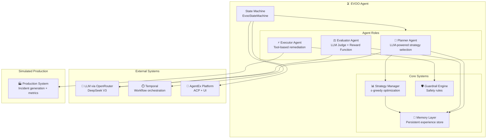
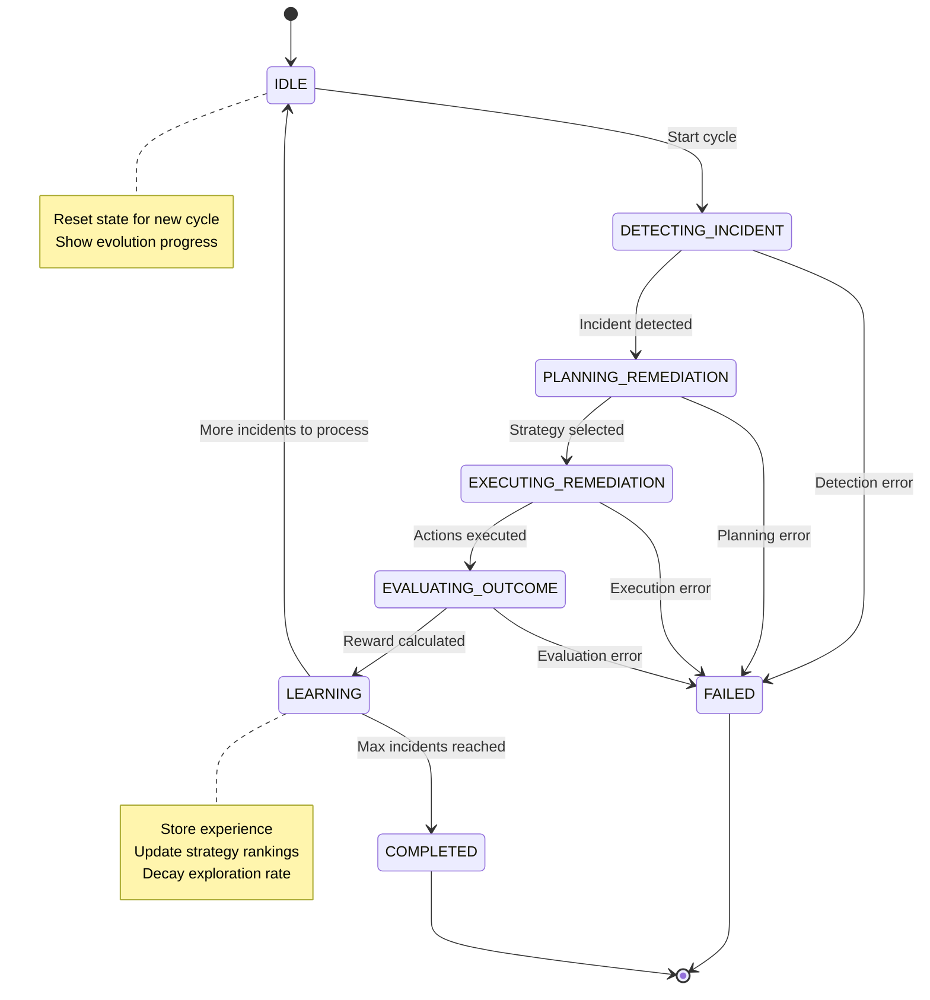
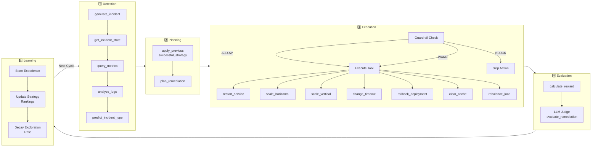
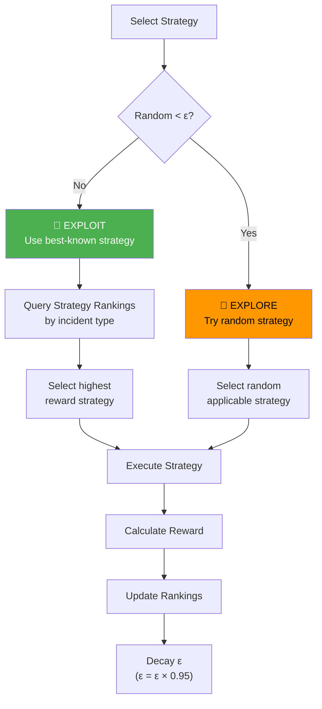
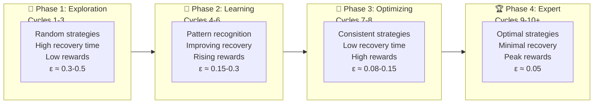

# 🫒 EVOO — Evolutionary Operations Optimizer

> An autonomous AI agent that behaves like a **Site Reliability Engineer (SRE)** and continuously improves its incident remediation strategy over time using feedback, memory, and strategy optimization.

EVOO detects production incidents, selects remediation strategies, executes actions, measures outcomes, scores success, stores experiences, and **learns which strategies work best** — evolving from a novice operator into an expert SRE over time.

---

## 📐 Architecture

### High-Level System Architecture



### Learning Loop State Machine



### Data Flow Architecture



### Strategy Selection: Exploration vs Exploitation



---

## 🎯 Core Capabilities

### 1. Autonomous Incident Detection
- Generates realistic production incidents from a simulated environment
- Supports 6 incident types with varying severity levels
- Produces measurable system metrics (latency, CPU, memory, error rate, availability)
- LLM-powered log analysis and incident type prediction

### 2. LLM-Driven Strategy Planning
- Uses OpenAI SDK via OpenRouter (DeepSeek V3) for intelligent reasoning
- Considers historical performance data when selecting strategies
- Retrieves best past strategies from memory for similar incidents
- Provides confidence scores and detailed reasoning for each decision

### 3. Guardrailed Execution
- **8 configurable safety rules** prevent dangerous actions
- Actions are checked against guardrails before execution
- Blocked actions are logged and shown in the UI with explanations
- All thresholds configurable via environment variables

### 4. Multi-Factor Reward Evaluation
- **Numerical reward function** with positive and negative factors
- **LLM-based qualitative judge** that adjusts reward ±20 points
- Considers: service restoration, recovery time, cost efficiency, latency improvement, error rate reduction

### 5. Persistent Memory & Learning
- Stores experience tuples after every incident cycle
- Tracks per-strategy performance (success rate, average reward, total uses)
- JSON file-based persistence for portability
- Enables retrieval of best strategies per incident type

### 6. Evolutionary Strategy Optimization
- **Epsilon-greedy** exploration vs exploitation with decaying ε
- Strategy rankings updated after every cycle
- Agent measurably improves over time (higher rewards, lower recovery times)
- Early runs: random exploration → Later runs: optimal strategy selection

### 7. Rich UI Observability
- Real-time tool call visibility (`ToolRequestContent` / `ToolResponseContent`)
- Evolution progress tracking with sparklines and comparison tables
- Phase indicators (🌱 Exploration → 🌿 Learning → 🌳 Optimizing → 🏆 Expert)
- Guardrail verdicts displayed inline (✅ ALLOW / ⚠️ WARN / 🛑 BLOCK)

---

## 🔧 Remediation Tools

### Core Tools

| Tool | Description | Parameters |
|------|-------------|------------|
| `restart_service()` | Restart the affected service | — |
| `scale_horizontal()` | Scale out to more instances | `target_instances: int` |
| `scale_vertical()` | Scale up instance resources | `target_cpu: float, target_memory: float` |
| `change_timeout()` | Adjust timeout configuration | `new_timeout: int` (ms) |
| `rollback_deployment()` | Rollback to previous version | — |
| `clear_cache()` | Clear service cache | — |
| `rebalance_load()` | Rebalance traffic distribution | — |
| `query_metrics()` | Query current system metrics | — |
| `get_incident_state()` | Get current incident state | — |

### Advanced Tools (LLM-Powered)

| Tool | Description | Powered By |
|------|-------------|------------|
| `analyze_logs()` | Analyze system logs for root cause patterns | LLM |
| `predict_incident_type()` | Predict incident type from metrics | LLM |
| `apply_previous_successful_strategy()` | Retrieve best historical strategy | Memory + LLM |
| `plan_remediation()` | Select and plan remediation strategy | LLM |
| `calculate_reward()` | Calculate numerical reward score | Formula |
| `evaluate_remediation_with_llm()` | Qualitative remediation evaluation | LLM Judge |

---

## 🛡️ Safety Guardrails

EVOO includes a configurable guardrail engine that prevents dangerous remediation actions.

### Guardrail Rules

| Rule | Default | Description |
|------|---------|-------------|
| `min_instances_for_restart` | 2 | Block restart if fewer instances running |
| `min_instances_for_rollback` | 2 | Block rollback if fewer instances running |
| `max_horizontal_instances` | 10 | Block scaling beyond this limit |
| `max_vertical_cpu` | 8.0 cores | Block CPU allocation beyond this |
| `max_vertical_memory` | 16.0 GB | Block memory allocation beyond this |
| `timeout_bounds` | 500–60000 ms | Block timeout outside this range |
| `cost_budget` | $50.00 | Block actions if cost exceeds budget |
| `max_restarts_per_incident` | 3 | Block after N restarts per incident |
| `max_rollbacks_per_incident` | 1 | Block after N rollbacks per incident |
| `max_total_actions` | 10 | Block after N total actions per incident |
| `healthy_system_guard` | 0.85 | Warn if system already healthy |

### Verdict Types

- **✅ ALLOW** — Action is safe to execute
- **⚠️ WARN** — Action proceeds but with a warning
- **🛑 BLOCK** — Action is blocked with explanation and suggestion

### Configuration

All guardrail thresholds are configurable via environment variables:

```bash
EVOO_GUARDRAILS_ENABLED=true
EVOO_MIN_INSTANCES_FOR_RESTART=2
EVOO_MIN_INSTANCES_FOR_ROLLBACK=2
EVOO_MAX_HORIZONTAL_INSTANCES=10
EVOO_MAX_VERTICAL_CPU=8.0
EVOO_MAX_VERTICAL_MEMORY=16.0
EVOO_MIN_TIMEOUT_MS=500
EVOO_MAX_TIMEOUT_MS=60000
EVOO_MAX_COST_PER_INCIDENT=50.0
EVOO_MAX_RESTARTS_PER_INCIDENT=3
EVOO_MAX_ROLLBACKS_PER_INCIDENT=1
EVOO_MAX_ACTIONS_PER_INCIDENT=10
EVOO_BLOCK_IF_HEALTHY=true
EVOO_HEALTHY_THRESHOLD=0.85
```

---

## 🏗️ Incident Types

| Type | Description | Metrics Affected | Example Strategies |
|------|-------------|------------------|--------------------|
| `service_crash` | Service not responding | availability ↓, error_rate ↑ | restart_and_verify, rollback_and_restart, scale_and_restart |
| `high_latency` | Abnormally high response times | latency_ms ↑ | scale_out_for_latency, cache_and_rebalance, vertical_scale_for_latency |
| `cpu_spike` | CPU utilization at dangerous levels | cpu_percent ↑ | vertical_scale_cpu, horizontal_scale_cpu, restart_for_cpu |
| `memory_leak` | Continuously increasing memory usage | memory_percent ↑ | restart_for_memory, rollback_memory_leak, scale_and_cache_memory |
| `network_degradation` | Network connectivity issues | latency_ms ↑, error_rate ↑ | rebalance_network, scale_and_timeout_network, restart_and_rebalance_network |
| `timeout_misconfiguration` | Incorrect timeout settings | error_rate ↑ | fix_timeout, rollback_timeout, timeout_and_restart |

### System Metrics

| Metric | Description | Healthy Range |
|--------|-------------|---------------|
| `latency_ms` | Response latency in milliseconds | < 200ms |
| `cpu_percent` | CPU utilization percentage | < 70% |
| `memory_percent` | Memory utilization percentage | < 75% |
| `error_rate` | Request error rate (0.0–1.0) | < 0.01 |
| `availability` | Service availability (0.0–1.0) | > 0.99 |
| `recovery_time_seconds` | Time to recover from incident | < 60s |

---

## 📊 Reward Function

### Numerical Reward Formula

```
reward = base_score + improvements - penalties

Where:
  base_score     = 100  (if service restored, else 0)

  improvements   = latency_improvement × 0.1
                 + availability_improvement × 100
                 + cpu_improvement × 0.3
                 + memory_improvement × 0.3

  penalties      = recovery_time_seconds × 0.5
                 + infrastructure_cost × 0.2
                 + error_rate_after × 50
```

### LLM Judge Evaluation

The LLM evaluator acts as a qualitative judge, assessing:
- Was the strategy appropriate for the incident type?
- Were the actions efficient or wasteful?
- Could a better approach have been used?
- Adjusts the numerical reward by **-20 to +20 points**

---

## 📈 Expected Behavior Evolution



| Metric | Early Runs | Later Runs |
|--------|-----------|------------|
| Strategy selection | Random exploration | Optimal exploitation |
| Recovery time | 60–120 seconds | 10–30 seconds |
| Reward score | 20–50 points | 80–120 points |
| Exploration rate (ε) | 0.3–0.5 | 0.05 (minimum) |
| Success rate | ~40% | ~90%+ |

---

## 🧠 Memory Model

### Experience Schema

Each incident cycle produces an experience tuple:

```json
{
  "incident_type": "high_latency",
  "metrics_before": {
    "latency_ms": 850.0,
    "cpu_percent": 45.0,
    "memory_percent": 60.0,
    "error_rate": 0.15,
    "availability": 0.85
  },
  "strategy_used": "cache_and_rebalance",
  "tools_called": ["clear_cache", "rebalance_load"],
  "metrics_after": {
    "latency_ms": 120.0,
    "cpu_percent": 35.0,
    "memory_percent": 55.0,
    "error_rate": 0.01,
    "availability": 0.99
  },
  "recovery_time": 28.5,
  "reward": 92.3,
  "timestamp": "2026-02-14T10:30:00Z"
}
```

### Strategy Performance Records

```json
{
  "strategy_name": "cache_and_rebalance",
  "incident_type": "high_latency",
  "total_uses": 5,
  "successes": 4,
  "failures": 1,
  "average_reward": 85.6,
  "best_reward": 102.3,
  "worst_reward": 45.2
}
```

---

## 🏛️ Agent Architecture

### Component Roles

| Component | Role | Implementation |
|-----------|------|----------------|
| **Planner Agent** | Evaluates system state, considers history, selects strategy | LLM-powered via `plan_remediation()` |
| **Executor Agent** | Executes remediation tools sequentially with guardrail checks | Temporal activities |
| **Evaluator Agent** | Calculates reward + LLM qualitative judgment | Formula + LLM Judge |
| **Strategy Manager** | Ranks strategies, manages exploration/exploitation | Epsilon-greedy with decay |
| **Memory Layer** | Stores and retrieves experience tuples | JSON file persistence |
| **Guardrail Engine** | Validates actions before execution | Rule-based safety checks |
| **Production System** | Simulates incidents and responds to remediation | Stateful simulation |

### State Machine Data Model

The `EvooData` model tracks the complete state across the learning loop:

- **Task tracking**: cycle count, turn count, loop control
- **Incident state**: type, severity, metrics before/after
- **Planning state**: selected strategy, reasoning, confidence, exploration flag
- **Execution state**: actions executed, tools called, cost, recovery time
- **Evaluation state**: reward, breakdown, LLM evaluation, adjusted reward
- **Learning state**: experience stored flag, rankings updated flag
- **Observability**: agent metrics, strategy rankings history

---

## ⚙️ Configuration

### Environment Variables

| Variable | Default | Description |
|----------|---------|-------------|
| `OPENAI_API_KEY` | — | API key for OpenRouter |
| `OPENAI_BASE_URL` | `https://openrouter.ai/api/v1` | LLM API base URL |
| `OPENAI_MODEL` | `deepseek/deepseek-r1-0528` | LLM model identifier |
| `EVOO_MAX_INCIDENTS` | `10` | Max incidents per learning session |
| `EVOO_EXPLORATION_RATE` | `0.3` | Initial exploration rate (ε) |
| `EVOO_MIN_EXPLORATION_RATE` | `0.05` | Minimum exploration rate |
| `EVOO_EXPLORATION_DECAY` | `0.95` | Exploration decay factor per cycle |
| `EVOO_GUARDRAILS_ENABLED` | `true` | Enable/disable guardrails |

### Helm Chart Values

Key values in [`values.yaml`](chart/evoo/values.yaml):

```yaml
env:
  OPENAI_API_KEY: <from-secret>
  OPENAI_BASE_URL: "https://openrouter.ai/api/v1"
  OPENAI_MODEL: "deepseek/deepseek-r1-0528"
  EVOO_GUARDRAILS_ENABLED: "true"
  EVOO_MAX_COST_PER_INCIDENT: "50.0"
```

---

## 🚀 Quick Start

### Prerequisites
- Python 3.12+
- Temporal server running
- AgentEx platform
- OpenRouter API key

### Local Development

```bash
# Port-forward to k8s services
kubectl port-forward -n agentex svc/agentex-temporal-frontend 7233:7233
kubectl port-forward -n agentex svc/agentex-postgresql 5432:5432
kubectl port-forward -n agentex svc/agentex-redis-master 6379:6379
kubectl port-forward -n agentex svc/agentex 5003:5003

# Setup virtual environment
cd agents/evoo
uv venv && source .venv/bin/activate && uv sync

# Set environment variables
export OPENAI_API_KEY="your-openrouter-api-key"
export OPENAI_BASE_URL="https://openrouter.ai/api/v1"
export OPENAI_MODEL="deepseek/deepseek-r1-0528"

# Run the agent
agentex agents run --manifest manifest.yaml
```

### Running the Worker Directly

```bash
cd agents/evoo
python -m project.run_worker
```

---

## 📁 Project Structure

```
agents/evoo/
├── manifest.yaml                    # Agent deployment configuration
├── pyproject.toml                   # Python project & dependencies
├── environments.yaml                # Environment-specific settings
├── Dockerfile                       # Container build configuration
├── .dockerignore                    # Docker build exclusions
├── README.md                        # This file
├── chart/                           # Helm chart for deployment
│   └── evoo/
│       ├── Chart.yaml
│       ├── values.yaml
│       ├── values.qa.yaml
│       └── charts/
│           └── temporal-worker/
└── project/
    ├── __init__.py
    ├── acp.py                       # ACP server configuration
    ├── constants.py                 # OpenRouter LLM configuration
    ├── workflow.py                  # Main EVOO workflow (BaseWorkflow)
    ├── run_worker.py                # Temporal worker entry point
    │
    ├── models/                      # Pydantic data models
    │   ├── enums.py                 # EvooState, IncidentType, Severity, ActionType
    │   ├── incidents.py             # SystemMetrics, Incident
    │   ├── strategies.py            # RemediationAction, RemediationStrategy, StrategyRecord
    │   └── experience.py            # Experience tuple model
    │
    ├── simulation/                  # Simulated production system
    │   └── production_system.py     # Incident generation, metric simulation
    │
    ├── memory/                      # Persistent experience storage
    │   └── experience_store.py      # JSON file-based experience persistence
    │
    ├── strategy/                    # Strategy management
    │   ├── strategy_catalog.py      # 18 predefined remediation strategies
    │   └── strategy_manager.py      # ε-greedy selection with decay
    │
    ├── guardrails/                  # Safety guardrails
    │   └── safety_rules.py          # GuardrailEngine with 8 configurable rules
    │
    ├── activities/                  # Temporal activities (tools)
    │   ├── remediation_tools.py     # 9 core remediation actions
    │   ├── analysis_tools.py        # LLM-powered log analysis & prediction
    │   ├── evaluation_tools.py      # Reward calculation + LLM judge
    │   ├── planning_tools.py        # LLM-powered strategy planning
    │   └── simulation_tools.py      # Incident generation activities
    │
    ├── state_machines/              # State machine definition
    │   └── evoo.py                  # EvooData + EvooStateMachine
    │
    └── workflows/                   # State workflow implementations
        ├── terminal_states.py       # Completed/Failed state handlers
        ├── idle/
        │   └── idle_workflow.py     # Welcome banner, cycle transitions
        ├── detection/
        │   └── detecting_incident_workflow.py
        ├── planning/
        │   └── planning_workflow.py
        ├── execution/
        │   └── execution_workflow.py
        ├── evaluation/
        │   └── evaluation_workflow.py
        └── learning/
            └── learning_workflow.py
```

---

## 📊 Observability

### Logged Events
- All state transitions with timestamps
- Every tool call with request parameters and response data
- Guardrail verdicts (ALLOW/WARN/BLOCK) with reasons
- Reward calculations with full breakdown
- Strategy ranking updates after each cycle
- LLM evaluation judgments

### Tracked Metrics
- **Average recovery time** — should decrease over time
- **Average reward** — should increase over time
- **Strategy success rate** — per incident type
- **Exploration rate (ε)** — should decay over time
- **Cost per incident** — tracked and budgeted
- **Guardrail block rate** — safety intervention frequency

### UI Evolution Indicators

| Phase | Icon | Cycles | Characteristics |
|-------|------|--------|-----------------|
| Exploration | 🌱 | 1–3 | Random strategies, high variance |
| Learning | 🌿 | 4–6 | Pattern recognition, improving |
| Optimizing | 🌳 | 7–8 | Consistent, near-optimal |
| Expert | 🏆 | 9+ | Peak performance, minimal exploration |

---

## ✅ Success Criteria

| Criterion | Measurement |
|-----------|-------------|
| ✅ Agent improves remediation performance over time | Reward trend is positive |
| ✅ Agent selects best strategies based on experience | Exploitation rate increases |
| ✅ Reward improves over time | Average reward in later cycles > early cycles |
| ✅ Recovery time decreases over time | Average recovery time trend is negative |
| ✅ Agent demonstrates autonomous learning | Strategy rankings evolve based on outcomes |
| ✅ System is modular, observable, and extensible | Clean separation of concerns, rich logging |
| ✅ Safety guardrails prevent dangerous actions | Blocked actions logged with explanations |
| ✅ All decisions are LLM-driven | No hardcoded rule-based logic for analysis |

---

## 🔗 Technology Stack

| Component | Technology |
|-----------|------------|
| **LLM Provider** | OpenRouter (DeepSeek V3) via OpenAI SDK |
| **Agent Framework** | scale-agentex (ACP, BaseWorkflow, StateMachine) |
| **Workflow Engine** | Temporal |
| **Language** | Python 3.12 |
| **Data Models** | Pydantic v2 |
| **Persistence** | JSON file storage |
| **Deployment** | Helm + Kubernetes |
| **Container** | Docker (python:3.12-slim) |
